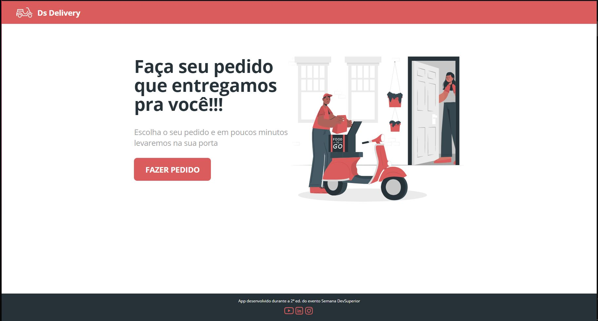
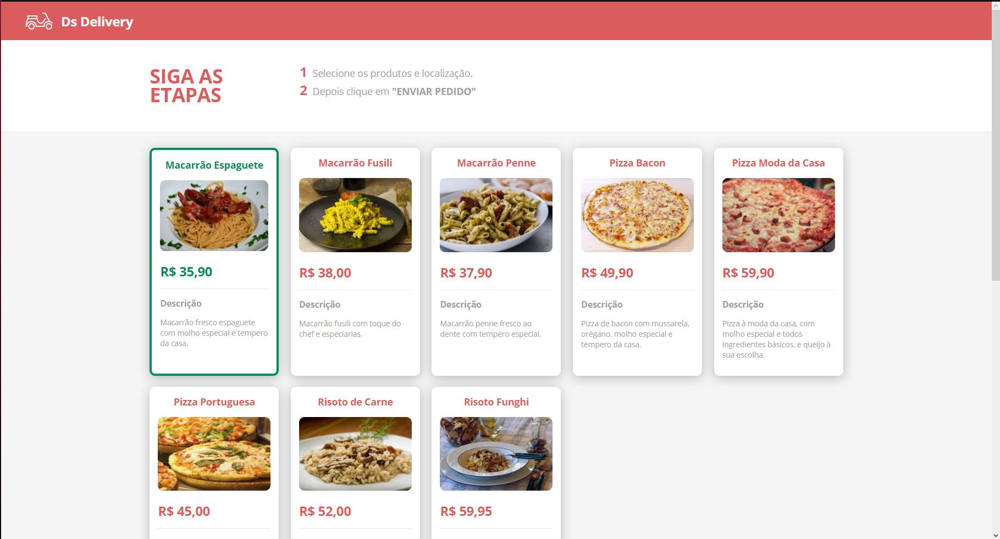
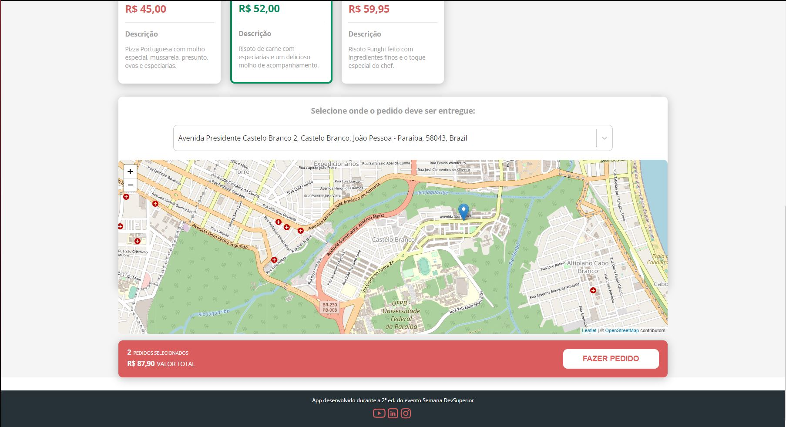
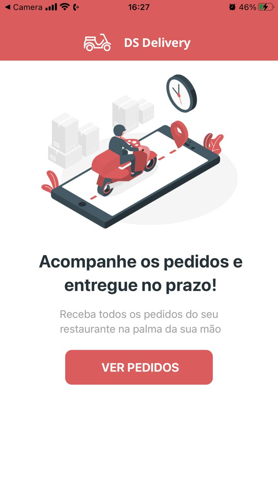
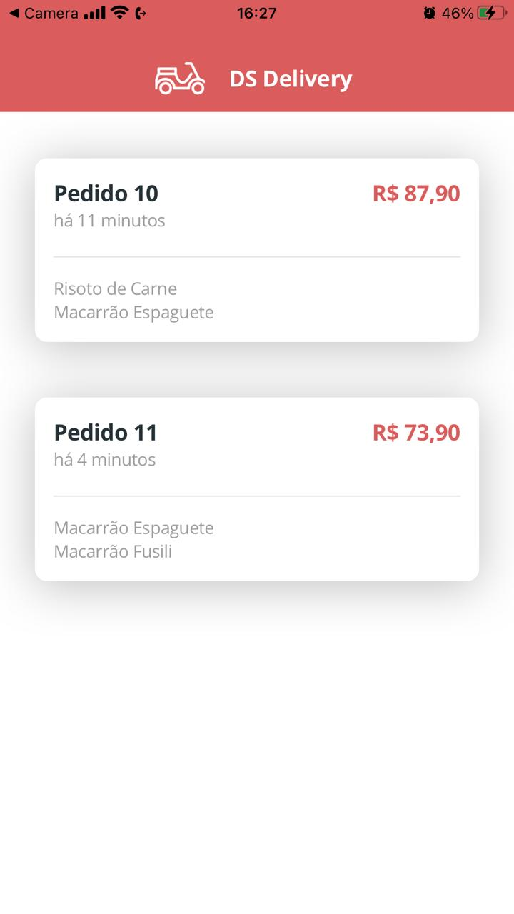
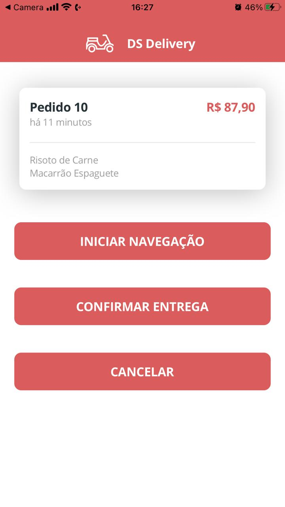

<h1 style="color:white;font-size:50px;font-weight:bold">Semana DevSuperior 2.0</h1>

<h2 id="sobre">Sobre o Projeto</h2>

O Projeto é um sistema de pedidos onde é feito os pedidos em um site web, selecionando os produtos e um endereço e confirmando o pedido, e
no app mobile é onde os pedidos aparecem para que sejam entregues. Dentre as funcionalidades estão selecionar o pedido e iniciar a navegação
através da chamada do google Maps onde a rota de entrega será mostrada e iniciada pelo mesmo. Após a chegada ao destino existe o botão de 
confirmar entrega que ao selecioná-lo e confirmado, o pedido é retirado da lista de pedidos é marcado como entregue, e então é retornada uma
mensagem que o pedido foi entregue. A opção cancelar retorna para a tela anterior.

<h2 id="link">Link da aplicação WEB</h2>
https://sds2-samuelgomes.netlify.app  
obs: talvez o sistema de procura de endereços não funcione no momento em que estiver tentando utiliza-lo devido a inatividade do sistema do mapbox.
Caso isso venha a acontecer, por favor, informar-me para que eu possa re-ativalo. 

<h2 id="ferramentas">Ferramentas Utilizadas</h2>

- [JDK11]
- [STS - Spring Tools Suite]
- [Postman]
- [Postgres 12 e pgAdmin]
- [Heroku CLI]
- [NPM]
- [VS Code]
- [Git]

<h2 id="padraocamadasadotado">Imagens do Projeto</h2>
 
<h2 align="center">Site</h2>
 
<h1 align="center">
    
    
    
</h1>
 
<h2 align="center">App Mobile</h2>
 
<h1 align="center">
    
    
        
</h1>

